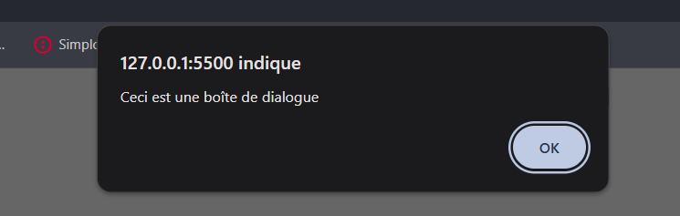
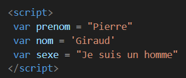
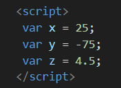
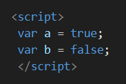
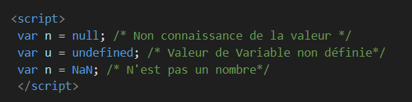

# Java Script (JS)
---
- Langage de programmation majoritairement "<u>Client Side</u>" →
s'exècute du coté du client (sur l'ordinateur de la personne qui demande la page WEB)

- Permet de créer des pages interactives et vivantes à l'aide de **Script** (Utilisé pour manipuler dynamiquement le code HTML d'une page)

- Orienté "Objet à prototype" → Va utiliser des objets dans son fonctionnement global

## Où écrire le code JS ?
- Dans le head HTML
- Dans le body HTML
- Dans un fichier .js séparé → recommandé pour les gros projets

## Syntaxe 
Trois manières possibles → 
- `alert('Texte');`
- `alert("Texte");`
- `alert(5.4);` → Pas de guillemets pour les nombres

## Indentation 
Décaler certaines lignes de code par rapport à d'autres. Permet de rendre son code plus lisible

## Commentaires 
- Commentaire monoligne → // Ici le commentaire
- Commentaire multiligne → /* Ici  
                            * le commentaire */   
                    ou →  /* Ici le commentaire */
(On peut également l'utiliser en monoligne, donc utilser cette syntaxe à chaque commentaire)

## Comment lier un fichier HMTL au JS ?
- A la fin de la page HTML → ``

## Qu'est ce qu'un `<Script>` ?
- Une suite d'instructions interprétées par un programme → 
Pour lire un code JS il faut un interprêteur (chaque navigateur possède son interprêteur JS)
- On peut en ajouter autant qu'on veut dans la page HTML, ils seront lus linéairement (c'est à dire dans l'ordre de la page). Pour des raisons de perfomance, il vaut mieux tout écrire dans le même Script

## Qu'est ce qu'un serveur ? 
- Sorte d'ordinateur très puissant, stock les pages WEB et les envoie au client lorsqu'il le demande

## Qu'est qu'un objet ?
- Correspond à un bloc cohérent de code, qui sert à effectuer telle ou telle opération

## Alert → Insère une boite de dialogue
Syntaxe → `alert('le texte ici');`
- dans l'élement Head → il affichera une boite de dialogue en début de page
- dans l'élement Body → il affichera également une boite de dialogue en début de page
- dans l'élément .JS → il affiche la même chose

***Exemple*** ↓

## Variable 
Syntaxe →

 `let NomVariable = Valeur;` → Déclare une variable modulable (on peut changer sa valeur)

 → `const NomVariable = Valeur;` → Déclare une variable constante (on ne peut pas changer sa valeur), utilisé par défaut

 → `var NomVariable = Valeur;` → Ancienne version

- Conteneur qui va servir à stocker temporairement une information (nombre, texte...)
- Stock plusieurs valeurs dans le temps, en écrasant la précèdente
- Nom variable peut contenir → lettre, chiffre, _ ou $
- Chaque variable a un nom unique → Identifieur
- = → sert à assigner/affecter une valeur à une variable
- Pour les booleans et les chiffres → pas de ""
- Pour le texte → ""

**Les différents types de valeurs**
- **String** : Les chaines de caractères (les textes) contenus dans des "" ou des '' ↓

- **Number** ↓ : Pas contenus dans des "" ou ''

- **Boolean** ↓ : Vérifie les conditions. Pas contenus dans des "" ou '' 

- **Autres valeurs** ↓ : Autres types que string, number ou boolean 

## Fonctions 

- **TypeOf** ↓ : Teste le type de valeur que contient une variable.
Attention ! Certains résultats peuvent être contestables

<!-- Arrêté à la vidéo 8/65 → Pierre Giraud -->

